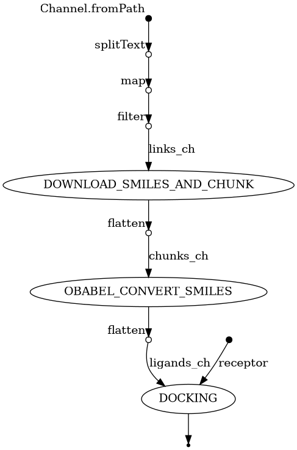
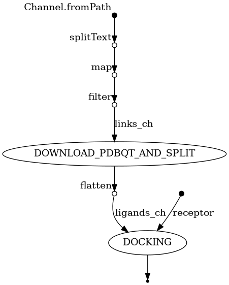

## Docking pipeline
Run `nextflow run main.nf` to start pipeline.

### Configurations
Change configurations on `nextflow.config`
```groovy
params {
    links_file          // (string) main downloader file
    outdir              // (string) results directory
    use3d_downloader    // (boolean) download mode
    receptor            // (string) receptor file
    // ...
}
```

### Dependencies
This pipeline executes locally so, you should have;

- UNIX/POSIX/LINUX OS (WSL on windows)
- gz, gunzip, split, curl, awk (etc.)
- nextflow
- obabel (2D MODE)
- vina_split (3D MODE)
- vina

### flowchart 2D MODE

### flowchart 3D MODE

